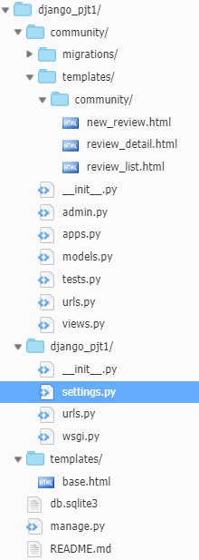
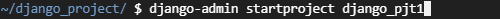
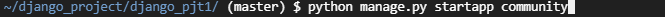
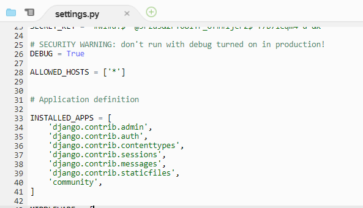
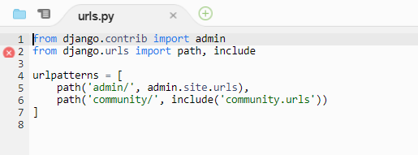
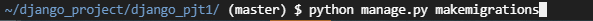
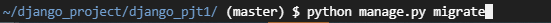
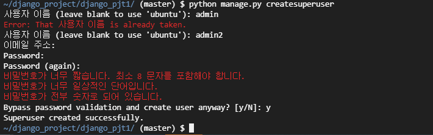
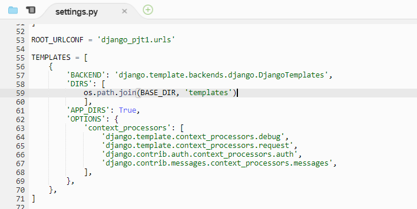

# django_pjt1

## 01. 프로젝트 구조



### 1. 프로젝트 생성



- django_pjt1 이라는 프로젝트를  django-admin을 이용해서 생성

### 2. community 앱 생성

#### 1. cmd



- 프로젝트 폴더로 이동 후, manage.py를 사용해서 community라는 앱 생성 (cd django_pjt1 생략)

#### 2. settings.py



- 앱을 생성하면 해당 앱을 settings.py의 INSTALLED_APPS에 등록해줘야 함 (호스트 개방하는건 기본!!)

#### 3. urls.py



- 멀티앱 구조를 하기 때문에 `include`사용
- /community/ 이후의 url은 community앱 하위의 `urls.py`에서 정의 

## 02. Model

### 1. 데이터 모델 정의

```python
from django.db import models
# Create your models here.
class Review(models.Model):
    title = models.CharField(max_length=100)
    content = models.TextField()
    rank = models.IntegerField()
    created_at = models.DateTimeField(auto_now_add=True)
    updated_at = models.DateTimeField(auto_now=True)
```

> Review 라는 테이블 정의

- 각각 칼럼은 title, content, rank, created_at, updated_at
- title은 문자열을 입력 받으면서 100자 이하
- content는 제한없는 문자열 입력가능
- rank는 숫자만 입력가능
- created_at은 데이터 입력시간을 자동으로 추가
- updated_at은 데이터 수정시간을 자동으로 추가

### 2. 데이터 모델 및 스키마 적용





- `makemigrations` : models.py에서 적용한 변경사항이나 추가/삭제된 사항들을 감지하여 파일로 생성
- `migrate` : 적용되지 않은 migrations(설정값)들을 실제로 적용

> 위의 두 코드는 같이 사용하며, 
>
> `makemigrations`가 모델의 변경사항들을 감지하고 기록하는 역할을 하며
>
> `migrate`는 그러한 변경사항들을 db에 저장하는 역할을 함

## 03.Admin 설정

> 정의한 모델을 관리자 페이지에서 데이터 `Create`, `Read`, `Update`, `Delete` 가능해야 함
>
> /admin 페이지

### 1. 관리자 계정 생성



** 기존에 admin 계정이 있는데 같은 이름으로 생성하려하니 에러 발생

- manage.py 를 이용해서 createsuperuser 즉 관리자 계정 생성
- 정보들을 입력하고 y입력으로 생성완료

## 04. base.html

> 모든 html페이지에서 공통으로 쓸 양식을 정의하는 파일
>
> 장고 특성상 앱 하위 templates가 아니므로 추가 설정을 해줘야함

### 1. settings.py



- base.html의 상위 폴더인 templates는 앱 하위에 있지 않기 때문에 DIRS에 등록해줘야함
- templates가 최상위 폴더 아래에 있다면 위의 코드와 같이 쓰면 됨
- 만약 templates가 프로젝트명 폴더 아래에 있다면, `os.path.join(BASE_DIR, '프로젝트명', 'templates')`로 작성

** APP_DIRS 은 값이 True면 앱하위 templates는 자동으로 탐색가능하게 해줌

### 2. base.html

```html
<!DOCTYPE html>
<html lang="ko">
<head>
    <meta charset="UTF-8">
    <meta name="viewport" content="width=device-width, initial-scale=1.0">
    <meta http-equiv="X-UA-Compatible" content="ie=edge">
    <title>Document</title>
    <link rel="stylesheet" href="https://stackpath.bootstrapcdn.com/bootstrap/4.4.1/css/bootstrap.min.css" integrity="sha384-Vkoo8x4CGsO3+Hhxv8T/Q5PaXtkKtu6ug5TOeNV6gBiFeWPGFN9MuhOf23Q9Ifjh" crossorigin="anonymous">
</head>
<body class='container'>
    <nav class="navbar navbar-expand-lg navbar-light bg-light">
      <a class="navbar-brand" href="/community">Community</a>
      <button class="navbar-toggler" type="button" data-toggle="collapse" data-target="#navbarNav" aria-controls="navbarNav" aria-expanded="false" aria-label="Toggle navigation">
        <span class="navbar-toggler-icon"></span>
      </button>
      <div class="collapse navbar-collapse" id="navbarNav">
        <ul class="navbar-nav">
          <li class="nav-item active">
            <a class="nav-link" href="/community">Review_list <span class="sr-only">(current)</span></a>
          </li>
          <li class="nav-item">
            <a class="nav-link" href="/community/new_review">New_review</a>
          </li>
        </ul>
      </div>
    </nav>

    
    

    <script src="https://code.jquery.com/jquery-3.4.1.slim.min.js" integrity="sha384-J6qa4849blE2+poT4WnyKhv5vZF5SrPo0iEjwBvKU7imGFAV0wwj1yYfoRSJoZ+n" crossorigin="anonymous"></script>
    <script src="https://cdn.jsdelivr.net/npm/popper.js@1.16.0/dist/umd/popper.min.js" integrity="sha384-Q6E9RHvbIyZFJoft+2mJbHaEWldlvI9IOYy5n3zV9zzTtmI3UksdQRVvoxMfooAo" crossorigin="anonymous"></script>
    <script src="https://stackpath.bootstrapcdn.com/bootstrap/4.4.1/js/bootstrap.min.js" integrity="sha384-wfSDF2E50Y2D1uUdj0O3uMBJnjuUD4Ih7YwaYd1iqfktj0Uod8GCExl3Og8ifwB6" crossorigin="anonymous"></script>
</body>
</html>
```

- 네비게이션바는 bootstrap을 이용
- ``으로 각 페이지마다 코드가 들어갈 공간을 마련 
- ``는 end를 써서 닫아주는것을 생활화 !!

## 05. Review_list

> 해당 페이지는 community 앱 하위의 페이지
>
> 따라서 대부분의 설정은 community 하위의 파일들로 설정
>
> 데이터베이스에 존재하는 모든 리뷰의 목록을 표시

### 1. urls.py

```python
from django.urls import path
from . import views

urlpatterns = [
    path('', views.review_list),
]
```

- /community로 요청했을때 해당 페이지를 반환해야 하며, 이미 `r_ urls.py`에서 /community까지는 지정했으므로 여기서는 `''`만 입력
- views에서 `review_list` 함수를 호출해야함
  - views.py와 urls.py는 같은 위치에 있음
    - 따라서 `from . import views`

### 2. views.py

> 페이지를 반환하기 전에 db에서 데이터를 모두 읽어와야함

```python
from django.shortcuts import render, redirect
from .models import Review
# Create your views here.

def review_list(request):
    reviews = Review.objects.all()
    context = {
        'reviews' : reviews,
    }
    return render(request, 'community/review_list.html',context)
```

- 데이터 클래스를 `models.py`에서 불러와야함

- 해당 클래스의 데이터를 모두 읽어서 context에 저장후 같이 반환

### 3. review_list.html

```html

    
        <h1>리뷰 목록!!</h1>
        <table class="table">
          <thead>
            <tr>
              <th scope="col">#</th>
              <th scope="col">title</th>
              <th scope="col">content</th>
              <th scope="col">rank</th>
              <th scope="col">created_at</th>
            </tr>
          </thead>
          <tbody>
            
                <tr>
                  <th scope="row">{{forloop.counter}}</th>
                  <td><a href="/community/review_detail/{{review.pk}}">{{review.title}}</a></td>
                  <td>{{review.content}}</td>
                  <td>{{review.rank}}</td>
                  <td>{{review.created_at}}</td>
                </tr>
            
          </tbody>
        </table>
    
```

- `base.html` 틀을 사용하기 위해서 `` 사용
- 그리고 코드를 입력할 블럭 지정 ` `
- 물론 닫아주는것은 기본!!
- context로 넘겨준 데이터를 반복문으로 각각 꺼냄

## 06. new_review

> form 작성
>
> title => input-text
>
> context => textarea
>
> rank => input-number
>
> 완료시 상세조회 페이지로 redirect

### 1. urls.py

```python
path('new_review/', views.new_review),
```

- `urls.py`의 urlpatterns에 위 코드 추가

### 2. views.py

```python
def new_review(request):
    return render(request, 'community/new_review.html')
```

- `views.py`에 해당 메소드 추가

### 3. new_review.html

```html

    
        <h1>새 리뷰 작성</h1>
            <form action='/community/create_review/'>
              <div class="form-group">
                <label for="exampleFormControlInput1">title</label>
                <input type="text" class="form-control" id="exampleFormControlInput1" name='title'>
              </div>
              <div class="form-group">
                <label for="exampleFormControlTextarea1">content</label>
                <textarea class="form-control" id="exampleFormControlTextarea1" rows="10" name='content'></textarea>
              </div>
              <div class="form-group">
                <label for="exampleFormControlInput2">rank</label>
                <input type="number" class="form-control" id="exampleFormControlInput2" name='rank' placeholder="0~10사이의 평점을 입력해주세요.">
              </div>

              <button type="submit" class="btn btn-primary">저장하기</button>
            </form>

    
```

- bootstrap의 form양식 사용
- 각각 `name` 값 지정! 중요!!
- form 태그에 `action`으로 target지정 ! 중요!!

## 07.create_review

> new_review.html에서 넘겨준 데이터를 활용해서 db에 저장 및 다음페이지 반환

### 1. urls.py

```python
    path('create_review/', views.create_review),
```

### 2. views.py

```python
def create_review(request):
    title = request.GET.get('title')
    content = request.GET.get('content')
    rank = request.GET.get('rank')

    review = Review()
    review.title = title
    review.content = content
    review.rank = rank
    review.save()
    # return redirect('/community')
    return redirect(f'/community/review_detail/{review.pk}')
```

- form태그로 넘겨주는 데이터는 `request`객체에 있음
  - `request.GET.get`으로 해당 데이터 접근 가능
- 데이터베이스 객체 생성
  - 객체에 각각 값 할당
  - `.save()`으로 실제 데이터베이스에 반영
- 주석된 코드 사용시 목록페이지로 이동
- 상세보기 페이지로 이동하고 싶을시 해당 리뷰의 pk값, 즉 id값을 `queryString` 방식으로 같이 넘겨줘야함

- 해당 함수에서는 반환하는 html문서가 없음

## 08. review_detail

> 리뷰 하나하나를 위한 페이지
>
> 즉, pk값으로 구분할수 있는 페이지가 되어야함
>
> title, content, rank, created_at, updated_at 표시

### 1. urls.py

```python
    path('review_detail/<int:review_pk>/', views.review_detail),
```

### 2. views.py

```python
def review_detail(request,review_pk):
    review = Review.objects.get(pk=review_pk)
    context = {
        'title' : review.title,
        'content' : review.content,
        'rank' : review.rank,
        'created_at' : review.created_at,
        'updated_at' : review.updated_at,
    }
    return render(request, 'community/review_detail.html', context)
```

- queryString으로 넘겨준 pk값을 받아와야 하기에 review_pk라는 인자 추가
  - `urls.py`에서 `<>`로 지정해준 이름과 동일해야함
- 그 외 특이사항 없음

### 3. review_detail.html

```html

    
        <h1>상세보기</h1>
        <table>
            <tr>
                <td colspan=2>{{title}}</td>
            </tr>
            <tr>
                <td colspan=2>content : </td>
            </tr>
            <tr>
                <td colspan=2>{{content}}</td>
            </tr>
            <tr>
                <td>작성 : {{created_at}}</td>
                <td>최종 수정 : {{updated_at}}</td>
            </tr>
        </table>
    
```

- 넘겨준 context 값 받아서 표시


## 09. 후기

/으로 경로 지정해주는게 생각보다 어려웠음

/를 쓸때는 현재 url에 추가로 연결하게 되고

/를 안쓰면 r_ url에 연결하게 됨

그외에 장고 개발 특성상 미리 여러 파일들을 만들어 놓고 시작하면 오류가 더 많이 발생할 가능성이 높음
