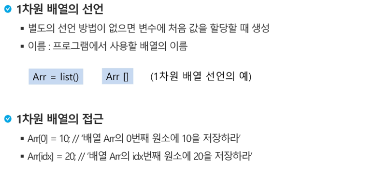

# Theory

#### `알고리즘` : 문제를 해결하기 위한 절차나 방법

- 컴퓨터 분야에서 알고리즘 표현법은 크게 2가지

  - 슈더코드
  - 순서도

- 좋은 알고리즘??

  - 정확성 : 얼마나 정확한지?
  - 작업량 : 얼마나 적은 연산으로 결과 도출이 가능한가?
  - 메모리 사용량 : 얼마나 적은 메모리를 사용하는지?
  - 단순성 : 얼마나 단순한지?
  - 최적성 : 더 이상 개선할 여지없이 최적화 되는지?

  

- 시간 복잡도(Time Complexity) - 빅 오(O) 표기법
  - 가장 큰 영향력을 주는 n에 대한 항만을 표시

- 배열의 필요성??
  - 여러 개의 변수가 필요할 때, 일일이 다른 변수명을 이용하기엔 비효율적일 수 있다.
  - 하나의 선언을 통해 둘 이상의 변수를 선언한 효과를 낼 수 있다.
  - 단순히 다수의 변수 선언을 의미하는 것이 아니라, 다수의 변수로는 하기 힘든 작업을 배열을 활용하면 쉽게 할 수 있다.

