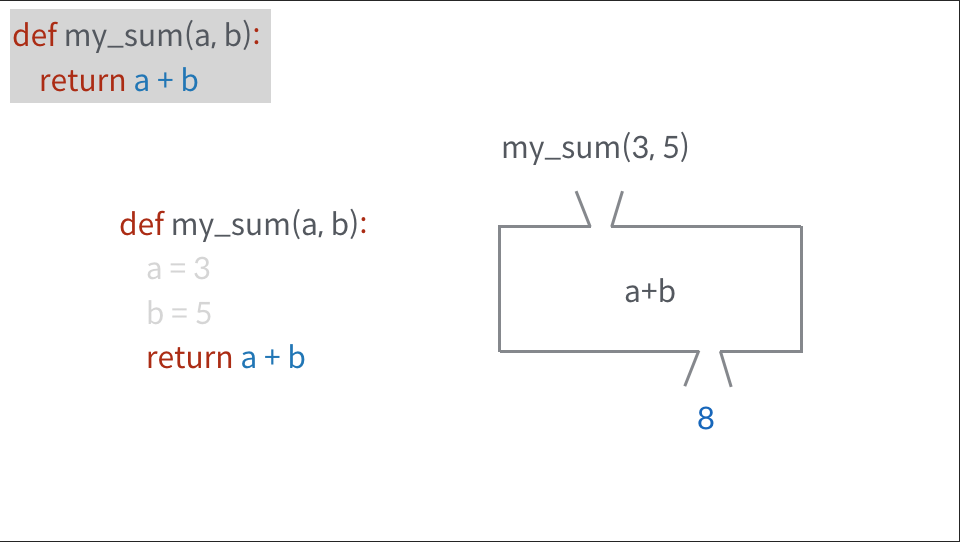
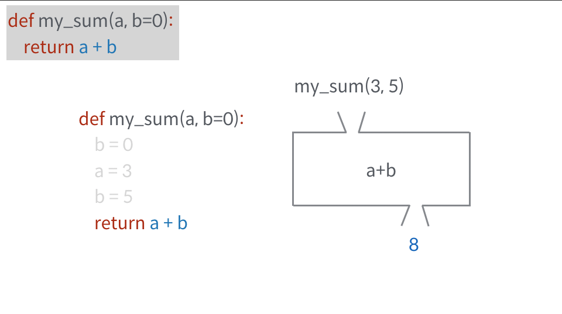
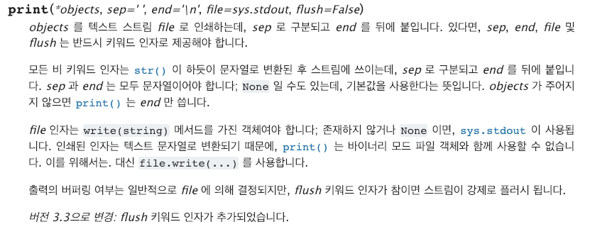

# Function-2

#### 함수의 인자(복습)

- 위치인자(Positional Arguments)

  - 함수는 기본적으로 인자를 위치로 판단한다.
  - 

  - 즉, 함수 호출시 입력하는 순서대로 매개변수에 입력됨

- 기본 인자 값(default값 설정)

  - 함수 호출시, 만약 인자를 지정하지 않아도 기본값으로 작동되게 함
  - 

  - 호출시 입력값이 있다면 입력한 인자를 활용하고, 없다면 default설정한 값을 활용함
  - **단, 기본 인자 이후에 기본 값이 없는 인자를 사용할 수는 없다**!!!

- 키워드 인자 (keyword arguments)
  - 함수 호출할때, (변수의 순서를 모를때) 직접 변수의 이름으로 특정 인자를 전달 할 수 있음.
  - 
  - 위 사진의 첫번째 줄을 읽어보면 `print()`함수에서 sep, end 등등의 인자는 키워드 인자로 반드시 제공해야한다는 언급이 있음.

- 가변 인자 리스트
  - 만약 인자의 갯수가 정확하지 않을 시 사용


#### 재귀 함수

- 함수 내부에서 자기 자신을 호출 하는 함수.

- 일반적으론 자주 사용 x. but,  몇몇 알고리즘을 구현할때는 유용

  - 예를들어 팩토리얼 알고리즘이 있음

    ```python
    def factorial(num):
        if num == 1:
            return 1
        return num*factorial(num-1)
    ```

- 재귀함수를 작성시에는 반드시, `base case`가 존재 하여야 한다.

- 최대 재귀 깊이는 1000

- 메모리 사용 ㅇ -> 실행속도가 늘어지는 단점 ㅇ

```python
# 재귀 이용 피보나치
def fib(num):
    if num ==0:
        return 0
    elif num ==1:
        return 1
    else :
        return fib(num-2)+fib(num-1)
# 반복문 이용 피보나치
def fib_loop(num):
    if num>=0:
        f = 0
        result=0
    if num>=1:
        s = 1
        result=1
    if num>= 2:
        for i in range(num-1):
            result= f + s
            f = s
            s = result
    return result
```

- 반복문과 재귀 함수의 차이

  - 시간 차이가 상당함

  - 알고리즘 자체가 재귀적인 표현이 자연스러운 경우 재귀함수를 사용한다
  - 재귀 호출은 `변수 사용` 을 줄여줄 수 있다.