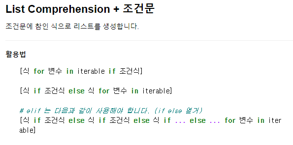

# List_Method

#### 값 추가 및 삭제

- `.append(x)` : 리스트에 값 추가(뒤에서부터), 1개만

  ```python
  cafe = ['starbucks', 'tomntoms', 'hollys']
  cafe.append('angelinus')
  cafe
  ```

- `.extend(iterable)` : 리스트에 iterable(list, range, tuple, string*유의*) 값을 붙일 수 있음, 여러개

  ​	string일 경우 문자를 하나씩 쪼개서 리스트에 추가함

  ```python
  cafe.extend(['빽다방', 'twosome'])
  cafe
  ```

  - list concatenate와 동일

    ```python
    cafe = cafe + ['maccafe', 'megacoffee']
    cafe
    ```

- `.insert(i, x)` : 정해진 위치 `i`에 `x`값을 추가합니다.

  ```python
  #처음에 넣을때
  cafe.insert(0,'hi')
  cafe
  #마지막에 넣을때  **-1을 입력시 마지막이 아니라 마지막에서 2번째 자리에 들어감
  cafe.insert(len(cafe),'bye')
  cafe
  #리스트의 길이를 넘어서는 인덱스는 마지막에 아이템이 추가됨
  cafe.insert(len(cafe)+100,'bye')
  cafe
  ```

- `.remove(x)` : 리스트에서 값이 x인 것을 삭제

  ```python
  numbers = [1, 2, 3, 1, 2]
  numbers.remove(1)
  numbers
  ```

- `.pop(i)` : 정해진 위치 `i`에 있는 값을 삭제하며, 

  ​	그 항목을 반환 `i`가 지정되지 않으면 마지막 항목을 삭제하고 되돌려줌

  ```python
  a = [1, 2, 3, 4, 5, 6]
  print(a.pop(0))		#1을 반환
  print(a)			#1이 제거된 리스트
  print(a.pop())		#6을 반환
  print(a)			#6이 제거된 리스트
  ```

- `.clear()` : 리스트의 모든 항목을 삭제

  ```python
  numbers = list(range(1,46))
  print(numbers)
  numbers.clear()
  print(numbers)
  ```

#### 탐색 및 정렬

- `.index(x)` : x 값을 찾아 해당 index 값을 반환 (값이 없을시 에러 발생)

  ```python
  a = [1, 2, 3, 4, 5]
  a.index(3)
  ```

- `.count(x)` : 원하는 값의 개수 확인

  ```python
  a = [1, 2, 5, 1, 5, 1]
  a.count(1)
  #활용 : 원하는값을 모두 삭제
  for i in range(a.count(1)):
      a.remove(1)
  print(a)
  ```

- `.sort()` : 정렬을 함. 내장함수 `sorted()` 와는 다르게 **원본 list를 변형**시키고, **None**을 리턴

  ```python
  import random
  lotto = random.sample(range(1,46),6)
  print(lotto)
  print(sorted(lotto))
  print(lotto)
  
  lotto.sort()# reverse option True 하면 내림차순 가능
  print(lotto)
  ```

- `.reverse()` : 반대로 뒤집음. 정렬 x

  ```python
  classroom = ['Tom', 'David', 'Justin']
  print(classroom)
  classroom.reverse()
  print(classroom)
  ```
#### 복사

- 리스트나 딕셔너리는 복사본을 수정함에도 불구하고 원본데이터가 같이 수정됨

```python
original_list = [1, 2, 3]
copy_list = original_list
copy_list[0] = 10
print(copy_list)
print(original_list)
```

​	- 파이썬에서 모든 변수는 객체의 주소를 가지고 있을 뿐이기 때문

​	- 변경가능한(mutable) 자료형과 변경불가능한(immutable) 자료형은 서로 다르게 동작

- 얕은 복사(shallow copy)

```python
#1
a= [1,2,3]
b= a[:]
b[0]=10
print(a)
#2
a= [1,2,3]
b= list(a)
b[0]=10
print(a)
```

	- 그러나 **리스트 안에 리스트가 있을경우**는 다시 주소만 참조하는 경우 발생

```python
a= [1,2,3,['a','b']]
b= a[:]
b[3][0]='c'
print(a)
```

- 리스트가 중첩된 상황에서 복사하고 싶을 경우 **깊은 복사(deep copy)**를 해야함

```python
import copy
a= [1,2,3,['a','b']]
b= copy.deepcopy(a)
b[3][0]='c'
print(a)
```

#### 리스트 내포(List Comprehension)

​		: 리스트안에 식, for 문을 지정함 -> 여러 줄의 코드를 한 줄로 줄일 수 있음

- 기본 형태


```python
#1~10까지의 숫자로 만든 세제곱 담긴 리스트 cubic_list
a = range(1, 11)
cubic_list = [ a**3 for a in a]
cubic_list
```

- +조건문 형태



```python
even_nums = [i for i in range(1,11) if i%2==0]
print(even_num)
```

- ##### 곱집합 : 주어진 두 list의 가능한 모든 조합을 담은 `pair` 리스트를 작성

```python
girls = ['jane', 'iu', 'mary']
boys = ['justin', 'david', 'kim']
pair= []
for girl in girls:
    for boy in boys:
        pair.append((girl,boy))
pair
```

- 예제)피타고라스 정리 만들기

```python
#반복문 활용한 일반식
pita=[]
for x in range(1,50):
    for y in range(x+1,50):
        for z in range(y+1,50):
            if x**2 + y**2 ==z**2:
                pita.append((x,y,z))
print(pita)

#comprehension 이용
pita=[(x,y,z) for x in range(1,50) for y in range(x+1,50) for z in range(y+1,50) if x**2 +y**2 ==z**2]
pita
```

- 예제)모음제거하기

```python
words = 'Life is too short, you need python!'
#반복문 활용
vowels = 'aeiou'
result = []
for word in words:
    if word not in vowels:
        result.append(word)
print("".join(result))
#comprehension
result= [ word for word in words if word not in ['a','e','i','o','u']]
"".join(result)
```

